## Goal

- Serverless 部署描述
- Serverless Stub 代码生成

## Arch

### IDE Features

- 语法高亮
- 代码格式化
- 代码提示
- 代码跳转
- 代码检测 (Lint)

### Compiler

负责将 Faasit DSL 转换为 Faasit IR

Faasit IR 为一种中间表示，包含了经过处理的 DSL 的语义信息，如类型和表达式，以 YAML 形式表示

Faasit IR 能够很好地被 Executor 处理，并执行不同的功能

### Executor

Executor 负责处理 Faasit IR，并执行不同的任务，包括

- Deploy：部署函数
- Invoke：调用函数
