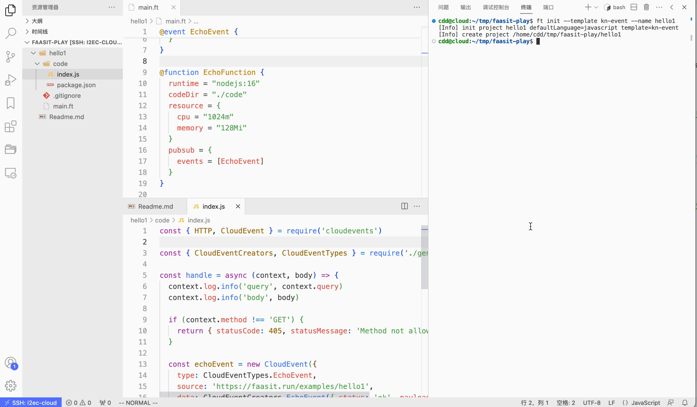
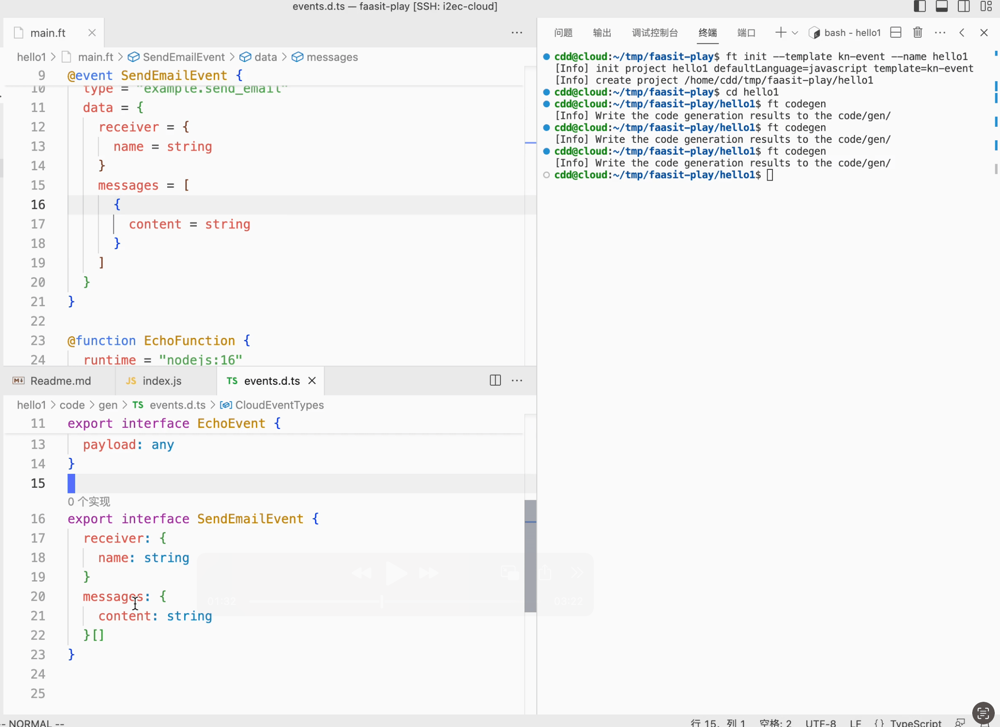
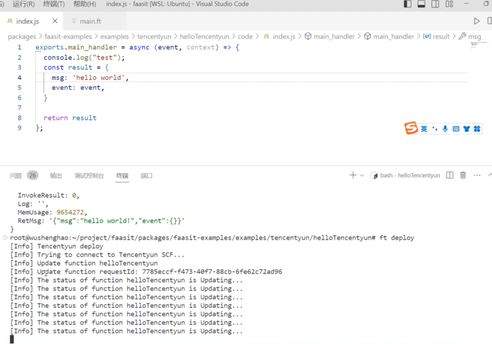
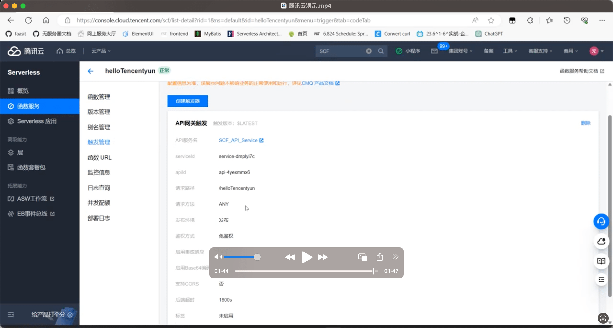
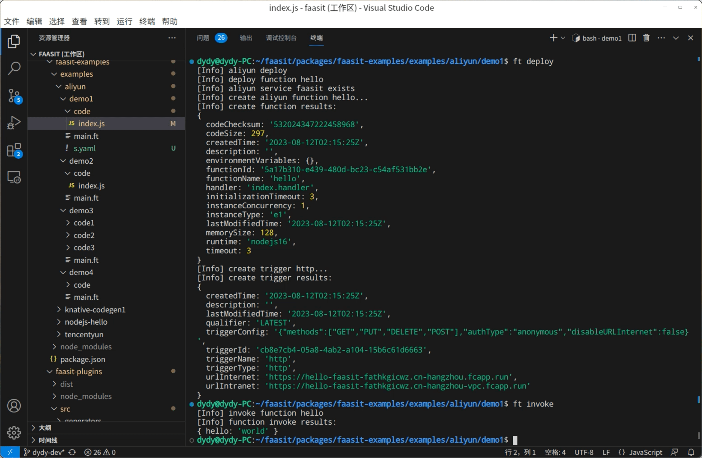
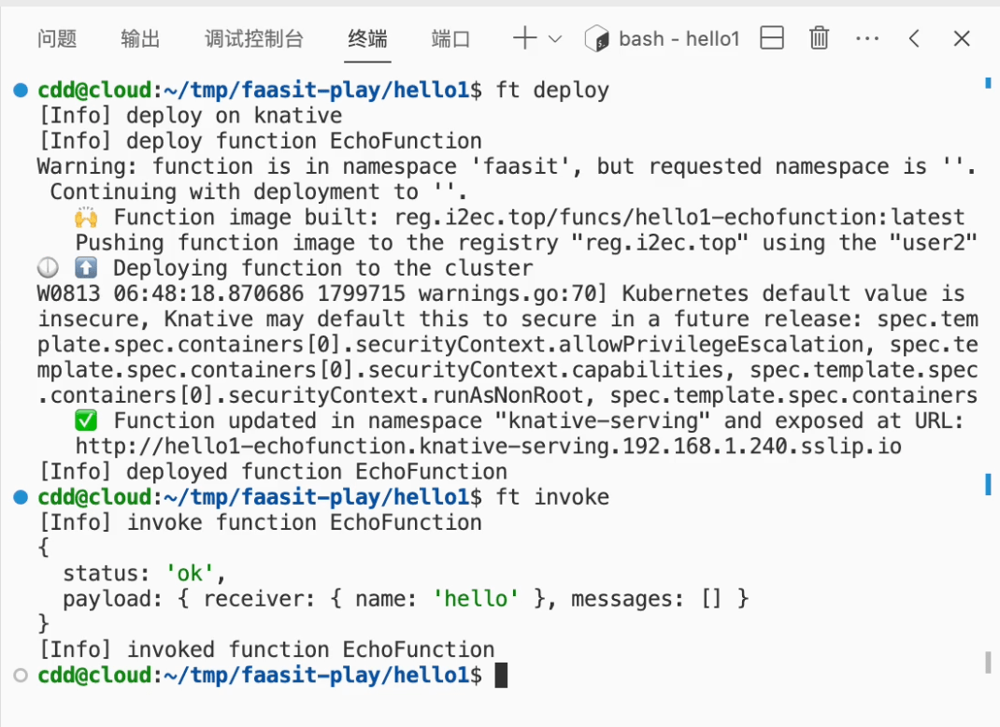

# Demo 2023-08-13

视频可见 https://box.nju.edu.cn/d/7d938e17398a46ffa6d6/

## 新增功能

- 添加项目初始化功能
- 添加代码生成功能
- 添加腾讯云 Provider
- 添加阿里云 Provider
- 添加 Knative Provider

### 项目初始化功能

使用 `ft init --name <project> --lang <language> --template <template>` 快速初始化一个可以运行、部署的 Serverless 函数项目

### 代码生成功能

使用 `ft codegen` 根据 `main.ft` 自动生成代码

如 Event 类型和工厂函数

### 腾讯云 Provider

支持部署函数到腾讯云平台

### 阿里云 Provider

支持部署函数到阿里云平台

### Knative Provider

支持部署函数到 Knative 平台

