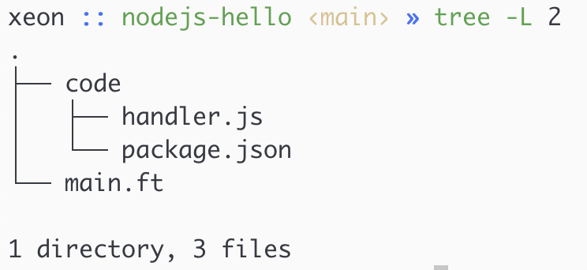
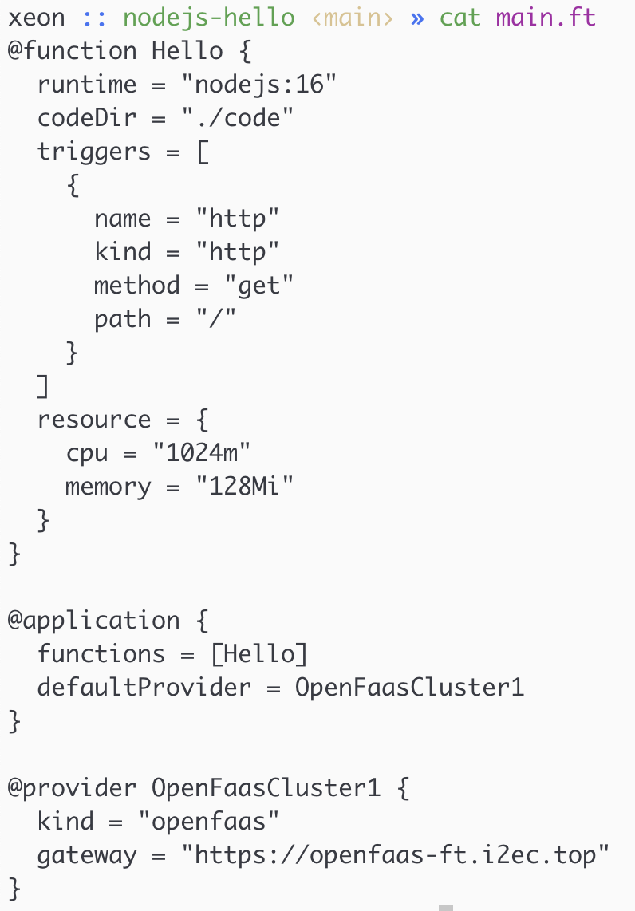
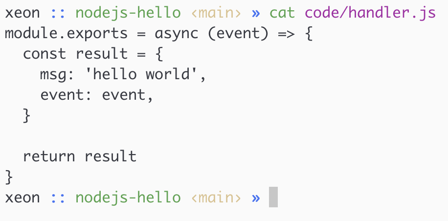
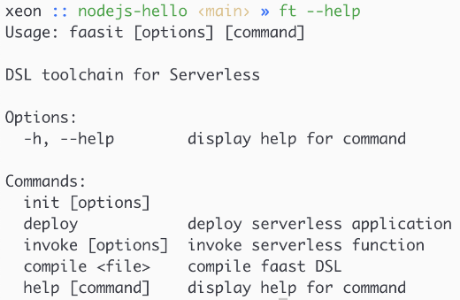
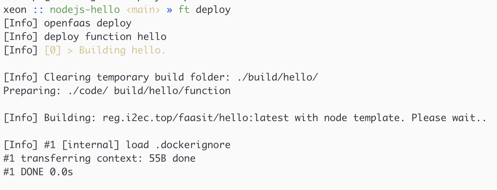
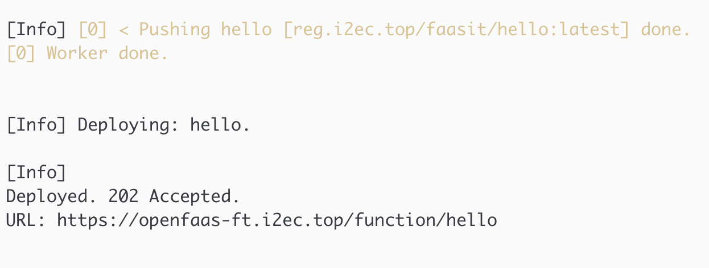
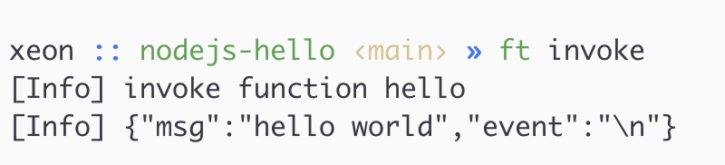
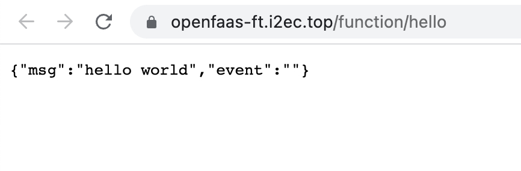

# 演示系统 1

## 流程

部署一个 NodeJs Serverless 函数至 OpenFaas 平台

**当前目录结构**

**Faast DSL 内容**

**Function Code 内容**

**Faasit CLI 帮助说明**

**Faasit 部署命令及结果 1**

**Faasit 部署命令及结果 2**

**部署成功，调用函数 1**

**部署成功，调用函数 2**

