# Faasit 组件设计

## 1 DSL 组件

### 语义分析模块

**符号解析系统**

- 符号表
- 模块解析

**类型系统**

- 类型推导
- 类型检查

## 2 IR 组件

### 插件模块 (LangPlugin)

**块处理插件**

负责处理 Block 类型，Block 可以看做是一种特殊的函数，由插件根据 Block 的入参和元信息注解，计算出 Block 的值

**代码生成插件**

代码生成插件负责根据 IR 生成目标代码，如 Yaml，Typescript，Python 等

## 3 执行器组件

### 插件模块 (ExecutorPlugin)

**云提供商插件**

实现云厂商特定的 `plan` 和 `apply` 函数，执行 Serverless 函数的部署

## 4 VSCode 插件组件

**VScode 插件**

**Web IDE**

基于 vscode-web 和 Faasit Web 插件实现的 WebIDE