## 项目背景与介绍

Faasit 是一个 DSL 和 Serverless 部署工具链。用户可以使用 Faasit DSL 描述
Serverless 应用的部署信息，Faasit 工具将自动执行部署、本地测试、代码生成和测试用
例生成等功能。

## 问题分析

### 需求分析

- Serverless 有许多供应商，每个供应商都有自己的部署方式，如何使用统一的部署描述来减少工作量？
- 如何以标准化的方法定义 Serverless 应用特征和必备概念？
- 部分自动化功能（如代码生成和测试用例生成）需要相关信息，如何以标准化的形式定义这些信息？
- 如何设计 DSL 语言使得部署信息编写更容易且易于自动化工具解析？

### 面向人群

- Serverless 应用开发工程师
- Serverless 平台运维工程师
- 自动化工具开发工程师

### YAML 的不足

YAML 是一种知名的数据序列化与定义格式，其被广泛应用于配置描述等场景。相关工
具如 Serverless Framework 与 Serverless Devs 使用 YAML 描述 Serverless 应用部署模型

YAML 是一种知名的数据序列化与定义格式，其被广泛应用于配置描述等场景。

相关工具 Serverless Framework 和 Serverless Devs 使用 YAML 描述
Serverless 应用的部署模型。

然而，YAML 语言的不足之处在于

1. 缺少标准的模块方案，不利于配置复用。
2. 在不影响可读性和易用性的情况下，难以描述复杂的语义信息，如类型、元信息等，而这对于自动化工具的开发是必要的。

### Serverless 应用特征

通过对腾讯云 SCF、阿里云 FC 和 OpenFaaS 的调研，我们总结了 Serverless 的概念模
型，以及 Serverless 应用特征和部署时需考虑的概念。

详见 [./serverless-concept-models.md](./serverless-concept-models.md)

## 解决方案

我们提出了 Faasit 系统，包括 Faasit DSL、Faasit IR 及 Faasit 工具链。使用 Faasit
DSL 描述 Serverless 应用部署信息，并利用 Faasit 工具自动执行部署、本地测试、代码
生成和测试用例生成等功能。

具体解决方案如下：

- Faasit DSL 能够描述 Serverless 部署信息，支持外部工具读取 DSL 信息，实现自动化工作
- Faasit DSL 较 Yaml、JSON 更高层，支持模块、类型、表达式、装饰器、编译时计算等高级语言特性，表达力强，易于应用开发者编写
- Faasit 系统支持插件机制，并设计规范化中间对象 Faasit IR，易于工具开发者开发插件，获取 DSL 元信息，开发自动化工具
- Faasit 工具链实现 Serverless 在不同平台上的部署，以及一些更高层的功能。

### Faasit 可能的用途

- 同一份应用部署声明，可部署至不同的云平台
- 自动化生成 Stub 代码，提供统一编程模型
- 定义拥有复杂关系的函数部署，如数据流处理 DAG
- 本地搭建模拟环境
- 测试用例自动生成
- 可视化函数以及部署信息
- 静态分析检查函数是否满足某些约束

## 相关工作

- Serverless Framework

- Serverless Devs

- Terraform

## Faasit 系统设计

系统分为两大功能模块，Faasit DSL 模块，Faasit 执行器模块

两个模块通过规范化中间对象表示 Faasit IR 进行交互

## Faasit 语言设计

详细设计见 [faasit-full-zh.md](./faasit-full-zh.md)

DSL 与 IR 分离的原因

- DSL 语言设计更加高阶，更加灵活，易于应用开发者编写
- IR 语言设计更加低阶，更加规范，包含编译器完整处理后的语义信息，易于工具开发者开发插件
- 在设计过程中，DSL 的语法细节等可能变动较大，而 IR 规范基本稳定，变化很小
- 编译器在语义分析阶段，会执行语法脱糖、模块解析、符号表构建、类型计算与推导、类型检查等步骤。
  - 这些语义计算结果将存放到 IR 中，插件开发者可直接使用这些信息，而不需要再对模块，符号，类型进行额外复杂的处理。

## 完整功能清单

## 当前进度

- [x] 通过对腾讯云、阿里云、OpenFaaS 的前期调研，初步提炼出 Serverless 应用的概念模型
  - Serverless 概念模型 [serverless-concept-models.md](./serverless-concept-models.md)
- [x] 设计完成初版的 Faasit DSL 与 Faasit IR 语言规范，涵盖重要的语言特性
  - 语言规范 [faasit-full-zh.md](./faasit-full-zh.md)
- [x] 实现 Faasit DSL 编译器以及 Language Server 原型，能够将 DSL 转换为 IR，提供基本的 IDE 功能
- [x] 实现 Faasit 执行器原型，能够利用 IR 在 OpenFaaS 平台上执行实际的应用部署

## 图片

**Faasit DSL，IR，Plan 示例图片**

**Faasit 用例图 1**

**Faasit 流程图 1**

**Faasit 流程图 2**

**Faasit 架构图 1**

**Faasit DSL 1**

