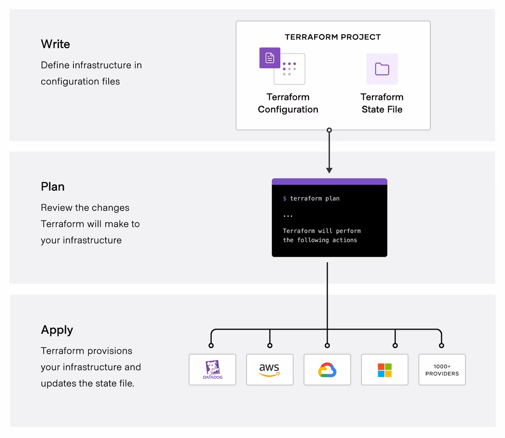

# 可供参考的资料

## 规范文档定义参考

可参考现有语言的规范，定义 Faasit 规范

**GraphQL Spec**

https://spec.graphql.org/October2021/

**Spec Md 使用**

https://spec-md.com/

## 画图参考

**Terraform 1**

https://developer.hashicorp.com/terraform/intro

