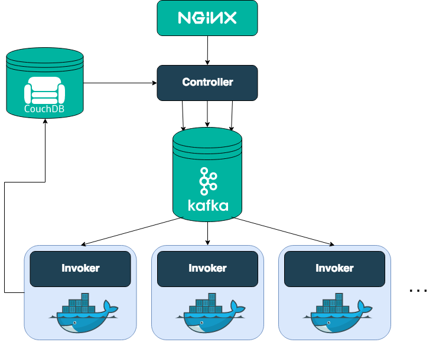

# Openwhisk

Apache 基金会开源的 Serverless 平台，能够在 Kubernetes 环境中部署

## Arch



## Operation

Using Helm to deploy kubernetes

see https://github.com/apache/openwhisk-deploy-kube/blob/master/README.md#kubernetes

Example to deploy openwhisk on kind, see https://github.com/apache/openwhisk-deploy-kube/blob/master/deploy/kind/mycluster.yaml

## Use

### CLI wsk

Openwhisk 提供命令行工具
[wsk](https://github.com/apache/openwhisk/blob/master/docs/cli.md#openwhisk-cli)
访问 Openwhisk 集群

**Authentication**

```sh
wsk property set --apihost API_HOST --auth AUTH_KEY --namespace guest
```

it will stores the properties in `~/.wskprops`

run `wsk list -v` to verify host connection


## User

使用 Openwhisk

## 

Openwhisk tigongde API

## Resource

- Document: https://openwhisk.apache.org/documentation.html
