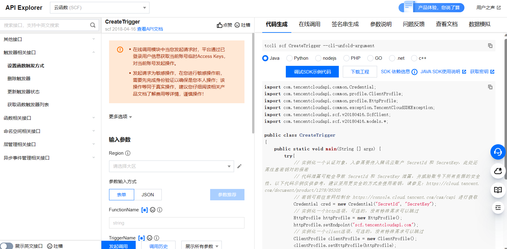

# 前言

腾讯云官方推荐并提供了[使用控制台](https://cloud.tencent.com/document/product/583/37509)和使用[Serverless 组件](https://cloud.tencent.com/document/product/1154/39271)（Tencent Serverless Cloud Framework）两种方式用于管理云函数，分别在浏览器中和本地CLI中进行开发。这两种方式更加方便开发者使用。

而对于我们的项目，采用调用API的方式进行函数、触发器管理更佳。腾讯云官方提供了各种主流语言的SDK供开发者调用API。

使用node SDK调用API的示例代码在`faasit/provider-examples/tencentyun`目录下。

# API实践

想要了解各API的用法，可先在腾讯云官方文档寻找：[云函数 API 概览-API 中心-腾讯云 (tencent.com)](https://cloud.tencent.com/document/api/583/17235)

腾讯云官方推荐[API Explorer](https://cloud.tencent.com/document/product/1278/46697)调试API和生成代码，它提供了在线调用、签名验证、SDK 代码生成和快速检索接口等能力：



总结使用API步骤：

1. 在[文档](https://cloud.tencent.com/document/api/583/17235)中找到想要的API，了解API的功能和用法；
2. 在[API Explorer](https://cloud.tencent.com/document/product/1278/46697)中下载代码或调试；
3. 安装代码所需要的对应依赖，并将参数（如秘钥等）替换成自己腾讯云账号的，密钥可前往[官网控制台](https://console.cloud.tencent.com/cam/capi)进行获取；
4. 为了项目的可维护性，参数可设置成环境变量或配置文件，并根据实际项目需要修改代码。

# 重要API整理

## 公共参数

[云函数 公共参数-调用方式-API 中心-腾讯云 (tencent.com)](https://cloud.tencent.com/document/api/583/17238)

使用Postman或者Curl直接发送请求时需要带上这些公共参数，下面是使用Curl发送请求的一个示例（由API Explorer生成）：

```
curl -X POST https://scf.tencentcloudapi.com -H "Authorization: TC3-HMAC-SHA256 Credential=AKIDntdFc3Qo12WwlvVaRtFeoF2s75BvoPiwIL8UvOXenQ-Ll8Le5SfIpM4jjLXyUGXX/2023-05-30/scf/tc3_request, SignedHeaders=content-type;host, Signature=08e82782ba555a81a8864c0ad57e0defbd27d0034eb5c8b1e5ccf60202fc1c2b" -H "Content-Type: application/json" -H "Host: scf.tencentcloudapi.com" -H "X-TC-Action: ListFunctions" -H "X-TC-Timestamp: 1685434170" -H "X-TC-Version: 2018-04-16" -H "X-TC-Language: zh-CN" -H "X-TC-Token: 8HVPWbJ4b60AFSi6IGd41mG7pXaNSxOa607adae527ed98cca05322893420aec9TaLLoQIydU0_J99sP40grvLXfat-hSb2ysPTMqHotagIIy8UJzTWestfbmhKd0nxBQuJhT6cM3ew1ii_Ug47velPmhuzQMIN9CvG0jw084q450d1mqEFSjdm2k64wpNgzTIFEn-633R2hPqlO_09jJY_AxdDsmpX80Z7PurEqGOHACiRFGCqVavLck2SVMVLkM7WBg_13IOkp12TSi3cOA" -d '{}'
```

而使用各种语言的SDK调用这些API则不需要管这些公共参数，仅需配置秘钥即可。

下面是一些重要的API，腾讯云官方的API文档已经很详细易用，了解更具体的用法可查看它。

## 函数相关API

### 获取函数列表

https://cloud.tencent.com/document/api/583/18582

### 创建函数

函数需要打包成.zip文件并采用BASE64编码转换成字符串在code的zipFile参数中，或先上传到腾讯云CosBucket对象存储桶中。

https://cloud.tencent.com/document/api/583/18586

### 删除函数

需要函数名。

https://cloud.tencent.com/document/api/583/18585

### 运行函数

需要函数名。

https://cloud.tencent.com/document/api/583/17243

### 获取函数详细信息

需要函数名。

https://cloud.tencent.com/document/api/583/18584

## 触发器相关API

### 设置函数触发方式

即创建触发器，需要触发器的名称、类型（ cos 、cmq、 timer 定时触发器、 ckafka、apigw API网关）、名字、[描述]([云函数 触发器配置描述-触发器-文档中心-腾讯云 (tencent.com)](https://cloud.tencent.com/document/product/583/39901))。触发器描述中指定触发器的配置。

https://cloud.tencent.com/document/api/583/18589

### 删除触发器

需要函数名、触发器名称、类型。

https://cloud.tencent.com/document/api/583/18588

### 更新触发器状态

开关触发器，需要函数名、触发器类型、触发器名、开或关。apigw类触发器无法开关。

https://cloud.tencent.com/document/api/583/89800

### 获取函数触发器列表

需要函数名。

https://cloud.tencent.com/document/api/583/44268
