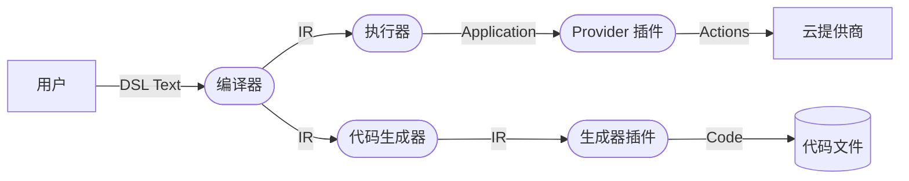

# 2023-07-10

## Background

8 月份会在南京线下开会，汇报工作进展，在开会之前，我们需要完成以下工作

- 在 Faasit 语言添加类似于 Protobuf 的 IDL 定义，能够定义 RPC Service 和函数
- 根据 IDL，自动生成可运行的 Serverless 函数代码（NodeJs）
- 函数间通信支持同步通信和异步通信
  - 同步通信基于 HTTP Trigger
  - 异步通信基于消息队列，可参考 Async API
- 收集 4 个 Serverless 案例，涵盖
  - 单个函数服务
    - 同步通信：对外暴露 Restful API，接收请求后，处理
    - 异步通信：接收消息队列的事件，事件到来后进行一些处理
  - 多个函数服务，形成 DAG 做数据流处理，同步、异步通信
- （重要）编写 Knative 平台的 Provider，验证能在 knative 平台上部署函数
- （次重要）编写腾讯云和阿里云的 Provider，验证 Faasit 能够在多个不同的云供应商上进行部署

上述目标暂定 8.4 之前完成 (4 周)

## 任务介绍

### 1 Faasit Use Case 1

部署 `/hello` API 的 Serverless function，代码结构为

```yaml
- hello-function/:
    - code/:
        - index.js
    - main.ft
    - package.json
```

在 `hello-function/` 目录下，使用 `ft deploy` 即可部署函数，涉及到的过程



### 2 Provider 插件注意事项

- 只需要关注 Application 对象与 Serverless 平台的特征
- 插件实现可参考 `packages/faasit-plugins/src/providers/openfaas/index.ts`

在 `@faasit/core` 中提供了一些辅助函数，方便编写插件

项目处于初期设计开发阶段，辅助函数可能不易使用，欢迎改进

## 任务及任务分工

### 0 任务需求

1. 收集 4 个 Serverless 案例
   1. 设计的 DSL 与 Provider 的实现需要支持收集到的 4 个 Serverless 案例，能够完成部署
   2. 现阶段 Serverless 的代码实现使用 NodeJs
   3. 代码生成框架支持生成 4 个 Serverless 案例的代码
2. Provider 实现
   1. Provider 的代码放到 `packages/faasit-plugins/src/providers` 目录
   2. 比如 Knative Provider，代码结构为 `packages/faasit-plugins/src/providers/knative/index.ts`
3. Generator 实现
   1. Provider 的代码放到 `packages/faasit-plugins/src/generators` 目录
   2. 比如 NodeJs Generator，代码结构为 `packages/faasit-plugins/src/generators/nodejs/index.ts`

### 1 DSL 语言设计和 @faasit/core 代码编写

- 完成 RPC IDL 定义以及实现
- 设计与编写辅助函数
- 人员
  - @brodyzhu
  - @WFUing

### 2 代码生成 & Knative 部署

- 优先完成代码生成任务
- 人员
  - @

### 3 Knative 调研 & Knative Provider 编写

- 调研 Knative 概念、术语，部署一个函数需要哪些操作等，文档写到 `docs/provider/knative.md` 中
- 人员
  - @cdd1037

### 4 Serverless 案例收集 & 腾讯云 Provider 编写

- 收集两个 Serverless 案例
  - 单函数同步调用
  - 多函数之间同步调用
- 建议：完成单函数的案例收集后，即可开始实现 Provider
- 人员
  - @wushenghao666

### 5 Serverless 案例收集 & 阿里云 Provider 编写

- 收集两个 Serverless 案例
  - 单函数异步调用
  - 多函数之间异步调用
- 建议：完成单函数的案例收集后，即可开始实现 Provider
- 人员
  - @Xdydy


## 辅助函数功能需求

当实现插件过程中，发现辅助函数无法满足需求或有可以改进的地方，可以补充在这里

